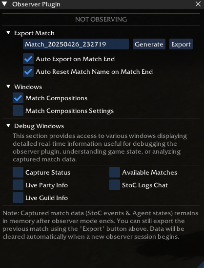
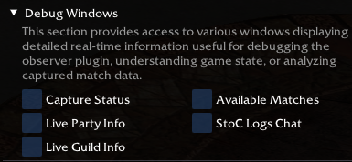
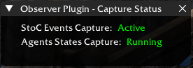
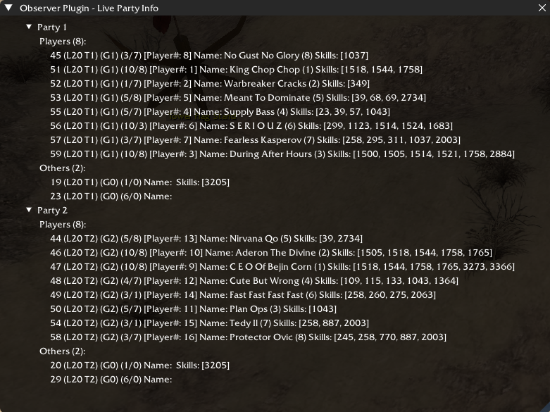
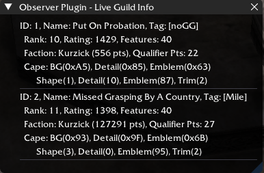
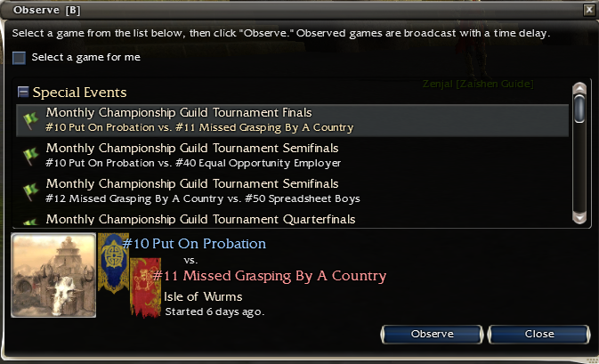
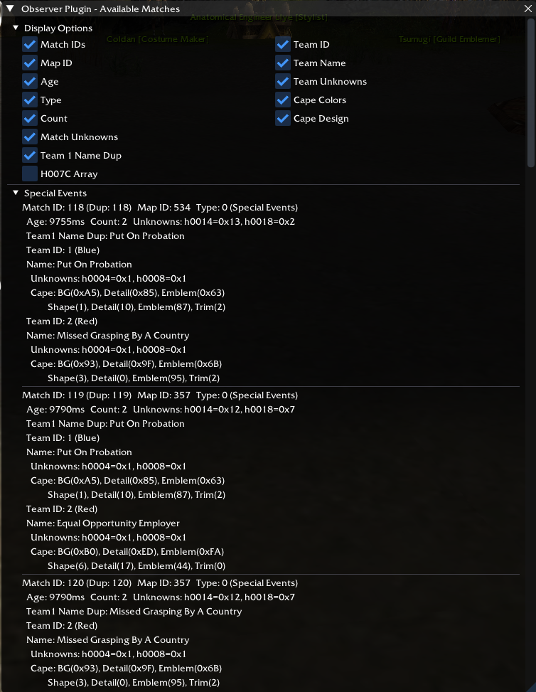
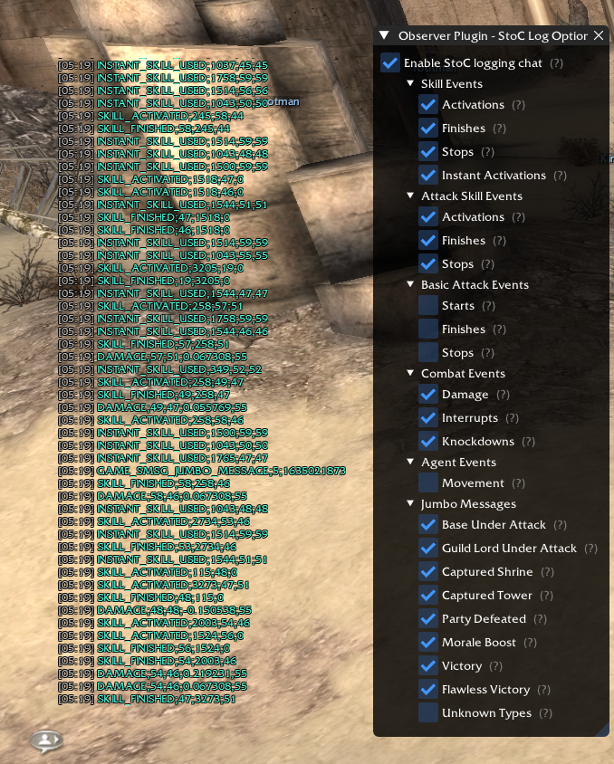

# Observer Plugin for GWToolbox++


## Overview

The Observer Plugin is a utility for [Guild Wars](https://www.guildwars.com/), designed to integrate with [GWToolbox++](https://github.com/gwdevhub/GWToolboxpp), that enables the replay of observed games. This plugin captures and preserves match data, allowing you to review past matches even after the original data is removed from the game client.

*Special thanks to the GWToolbox++ team for creating the plugin system that makes this possible!*

## Installation & Usage

To use the Observer Plugin:

1.  Download the latest `Observer.dll` from the [Releases page](https://github.com/SMN1337/ObserverPlugin/releases).
2.  Place the downloaded `Observer.dll` file into your GWToolbox++ `plugins` directory.

## User Interface

The plugin provides several windows to manage match exporting and view debug information.

### Main Window (`Observer Plugin`)

This is the primary control window for the plugin.



*   **Status:** Indicates if Observer Mode is currently active.
*   **Export Match:**
    *   Allows you to set a custom name for the next match export folder.
    *   `Generate`: Creates a default folder name based on the current timestamp.
    *   `Export`: Manually triggers the export of the last captured match data.
    *   `Auto Export`: Automatically exports logs when observer mode ends.
    *   `Auto Reset Name`: Automatically generates a new timestamped name after a match ends.
*   **Debug Windows:** Contains toggles to show/hide the various debug information windows.
*   **Note:** Reminds you that captured data stays in memory until a new observer session starts.

### Debug Windows

These windows provide detailed real-time information useful for debugging or analysis.

#### Debug Toggles

Located in the main plugin window, this section allows you to control the visibility of each debug window.



#### Observer Plugin - Capture Status

Shows the real-time status of the internal data capture processes.



*   **StoC Events Capture:** Indicates if Server-to-Client packets are being recorded.
*   **Agents States Capture:** Indicates if the thread capturing agent positions and states is running.

#### Observer Plugin - Live Party Info

Displays detailed information about all players, heroes, and henchmen currently detected in the instance, grouped by party ID.



*   Shows Agent ID, Level (L), Team ID (T), Guild ID (G), Professions, Player Number (for players), Name, and recently used Skill IDs.

#### Observer Plugin - Live Guild Info

Displays information about the guilds associated with players in the current instance.



*   Shows Guild ID, Name, Tag, Rank, Rating, Faction Info, and Cape Details.

#### Observer Plugin - Available Matches

Lists the matches available to observe in the current outpost, mirroring the game's own observer panel. It also includes display options to customize the information shown.

**Game's Observer Panel:**


**Plugin's Available Matches Window:**


*   **Display Options:** Toggle visibility for various match details (IDs, Map, Age, Type, Team info, Cape info, etc.).
*   **Match List:** Shows detailed information for each available match based on the selected display options.

#### Observer Plugin - StoC Log Options

Allows you to toggle real-time display of specific Server-to-Client (StoC) events in the game chat. *Note: All events are recorded internally for export regardless of these settings.*



*   Provides granular control over which types of events (Skill, Attack, Combat, Agent, Jumbo Messages) are logged to the chat.

## Building from Source

If you wish to contribute or build the plugin from the source code, follow these steps:

1.  **Set up the GWToolbox++ Development Environment:** Ensure you have a working build environment for GWToolbox++. Follow the setup guide in the [official GWToolbox++ repository](https://github.com/gwdevhub/GWToolboxpp/blob/master/README.md).
2.  **Clone the Repository:** Clone this Observer Plugin repository into the `plugins/` subdirectory of your GWToolbox++ source directory (e.g., `path/to/GWToolboxpp/plugins/Observer`). Note: The plugin folder *must* be named `Observer` for the build system to find it correctly.
3.  **Update CMake Configuration:** Modify the `GWToolboxpp/cmake/gwtoolboxdll_plugins.cmake` file by adding the following configuration block to register the plugin with the build system:
```cmake

# === Observer Plugin ===
# Requires ZLIB for log compression
find_package(ZLIB REQUIRED)

add_library(Observer SHARED)
target_sources(Observer PRIVATE
    "plugins/Observer/ObserverStoC.cpp"
    "plugins/Observer/ObserverStoC.h"
    "plugins/Observer/ObserverMatch.cpp"
    "plugins/Observer/ObserverMatch.h"
    "plugins/Observer/ObserverCapture.cpp"
    "plugins/Observer/ObserverCapture.h"
    "plugins/Observer/ObserverLoop.cpp"
    "plugins/Observer/ObserverLoop.h"
    "plugins/Observer/ObserverPlugin.cpp"
    "plugins/Observer/ObserverPlugin.h"
    "plugins/Observer/ObserverMatchData.h"
    "plugins/Observer/ObserverMatchData.cpp"
    "plugins/Observer/Debug/StoCLogWindow.h"
    "plugins/Observer/Debug/StoCLogWindow.cpp"
    "plugins/Observer/Debug/LivePartyInfoWindow.h"
    "plugins/Observer/Debug/LivePartyInfoWindow.cpp"
    "plugins/Observer/Debug/LiveGuildInfoWindow.h"
    "plugins/Observer/Debug/LiveGuildInfoWindow.cpp"
    "plugins/Observer/Debug/AvailableMatchesWindow.h"
    "plugins/Observer/Debug/AvailableMatchesWindow.cpp"
    "plugins/Observer/Debug/CaptureStatusWindow.h"
    "plugins/Observer/Debug/CaptureStatusWindow.cpp"
    "plugins/Observer/dllmain.cpp"
)
target_include_directories(Observer PRIVATE
    "plugins/Observer"
)
target_link_libraries(Observer PRIVATE
    plugin_base
    GWCA # Required for game context access
    ZLIB::ZLIB
)
target_compile_definitions(Observer PRIVATE WIN32)
# Common compile options (consider inheriting from plugin_base defaults if appropriate)
target_compile_options(Observer PRIVATE /W4 /WX /Gy /wd4201 /wd4505)
target_compile_options(Observer PRIVATE $<$<NOT:$<CONFIG:Debug>>:/GL>)
target_compile_options(Observer PRIVATE $<$<CONFIG:Debug>:/ZI /Od>)
# Common link options (consider inheriting from plugin_base defaults if appropriate)
target_link_options(Observer PRIVATE /WX /OPT:REF /OPT:ICF /SAFESEH:NO)
target_link_options(Observer PRIVATE $<$<NOT:$<CONFIG:Debug>>:/LTCG /INCREMENTAL:NO>)
target_link_options(Observer PRIVATE $<$<CONFIG:Debug>:/IGNORE:4098 /OPT:NOREF /OPT:NOICF>)
target_link_options(Observer PRIVATE $<$<CONFIG:RelWithDebInfo>:/OPT:NOICF>)
set_target_properties(Observer PROPERTIES FOLDER "plugins/")

```

> [!CAUTION]
> Some source files depend on **Base** sources (e.g., `../Base/stl.h`). Ensure your directory structure is correct when building to avoid compilation errors.

## Roadmap

This section outlines the planned development milestones for the Observer Plugin.

| Version | Goal                                                               | Status   |
| :------ | :----------------------------------------------------------------- | :------- |
| 0.1     | Setup handling for generic Server-to-Client (StoC) game events.    | Yes  |
| 0.1.2   | Track agent movement during matches.                               | Yes  |
| 0.2     | Implement initial match recognition logic.                         | Yes  |
| 0.3     | Filter StoC packet logging to only record during active matches.   | Yes  |
| 0.4     | Capture and export Jumbo Messages (e.g., Victory, Morale Boost).   | Yes  |
| 0.5     | Implement export functionality for all StoC packets within a match.| Yes  |
| 0.6     | Identify and record match metadata (Teams, Guilds, Map Info).      | Yes  |
| 0.x     | *(Reserved for further development)*                               |   |
| **1.0** | **Stable Release:** Reliable export of comprehensive match data.   |   |

**Future Enhancements & Ideas:**
*   Generate detailed statistics:
    *   Knockdown counts.
    *   Skill usage breakdown (Casted, Cancelled, Interrupted).
*   Track Guild Lord damage dealt.
*   Record and potentially visualize morale boost history.

## Disclaimer

This project is an unofficial, fan-made utility developed independently. It is not affiliated with, endorsed, or sponsored by ArenaNet or NCsoft and is intended for personal use only.

Guild Wars® and ArenaNet® are registered trademarks of NCSOFT Corporation. All rights reserved. All other trademarks are the property of their respective owners.

This plugin enhances the Guild Wars observer experience by capturing match data. It functions by reading publicly available game client memory *exclusively* while you are in observer mode/on outpost depending features.

*   **Read-Only:** It does not modify game files, memory, or network traffic.
*   **No Automation:** It does not automate any gameplay actions.
*   **Observer Mode Only:** Data capture is limited to when observing matches.

The purpose is solely to provide enhanced data logging and review capabilities for observed matches via the GWToolbox++ framework. This tool does not claim ownership of any Guild Wars assets or intellectual property.


