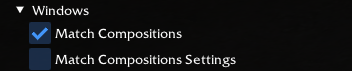
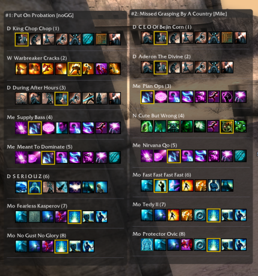

# Observer Plugin for GWToolbox++

## Overview

The Observer Plugin is a utility for [Guild Wars](https://www.guildwars.com/), designed to integrate with [GWToolbox++](https://github.com/gwdevhub/GWToolboxpp), that enables the replay of observed games. This plugin captures and preserves match data, allowing you to review past matches even after the original data is removed from the game client.

*Special thanks to the GWToolbox++ team for creating the plugin system that makes this possible!*

> [!CAUTION]
> Project is developed on `dev` branch of GWToolbox++, we are uploading toolbox DLL and Observer dll to assume a correct version, but you can use toolbox directly from their git release or either build yourself toolbox.

## Installation & Usage

To use the Observer Plugin:

1.  Download the latest `Observer.dll` from the [Releases page](https://github.com/SMN1337/ObserverPlugin/releases).
2.  Place the downloaded `Observer.dll` file into your GWToolbox++ `plugins` directory.

## Contributions
[Documentation](Docs/CONTRIB.md)

If you want to contribute, feel free to create pull requests / issues for bugs related or ideas. 

## User Interface

The plugin provides several windows to manage match exporting and view debug information.

### Main Window (`Observer Plugin`)

This is the primary control window for the plugin.

*   **Status:** Indicates if Observer Mode is currently active.
*   **Export Match:**
    *   Allows you to set a custom name for the next match export folder.
    *   `Generate`: Creates a default folder name based on the current timestamp.
    *   `Export`: Manually triggers the export of the last captured match data.
    *   `Auto Export`: Automatically exports logs when observer mode ends.
    *   `Auto Reset Name`: Automatically generates a new timestamped name after a match ends.
*   **Debug Windows:** Contains toggles to show/hide the various debug information windows.
*   **Note:** Reminds you that captured data stays in memory until a new observer session starts.

### Windows
This section describes windows designed to provide helpful information or features during gameplay.

#### Match Compositions
Displays the current team compositions for the observed match. For each player, hero, and henchman, it shows their name, profession, and equipped skills, including elite skill highlighting.

## Roadmap

This section outlines the planned development milestones for the Observer Plugin.

| Version | Goal                                                               | Status   |
| :------ | :----------------------------------------------------------------- | :------- |
| 0.1     | Setup handling for generic Server-to-Client (StoC) game events.    | Yes  |
| 0.1.2   | Track agent movement during matches.                               | Yes  |
| 0.2     | Implement initial match recognition logic.                         | Yes  |
| 0.3     | Filter StoC packet logging to only record during active matches.   | Yes  |
| 0.4     | Capture and export Jumbo Messages (e.g., Victory, Morale Boost).   | Yes  |
| 0.5     | Implement export functionality for all StoC packets within a match.| Yes  |
| 0.6     | Identify and record match metadata (Teams, Guilds, Map Info).      | Yes  |
| 0.7     | Match compositions window                                          | Yes  |
| 0.x     | *(Reserved for further development)*                               |   |
| **1.0** | **Stable Release:** Reliable export of comprehensive match data.   |   |

See issues of the project for current bugs and ideas of enhancements.

## Credits

- **Jon (GWToolbox++):** For contributions to observed match listing/entry.
- **[Mile] Team:** Tedy and Kenshin for their assistance with observer features and Lord Damage code base ([MileLDC](https://github.com/PewPewKenshin/MileLDC/)).

## Disclaimer

This project is an unofficial, fan-made utility developed independently. It is not affiliated with, endorsed, or sponsored by ArenaNet or NCsoft and is intended for personal use only.

Guild Wars® and ArenaNet® are registered trademarks of NCSOFT Corporation. All rights reserved. All other trademarks are the property of their respective owners.

This plugin enhances the Guild Wars observer experience by capturing match data. It functions by reading publicly available game client memory *exclusively* while you are in observer mode/on outpost depending features.

*   **Read-Only:** It does not modify game files, memory, or network traffic.
*   **No Automation:** It does not automate any gameplay actions.
*   **Observer Mode Only:** Data capture is limited to when observing matches.

The purpose is solely to provide enhanced data logging and review capabilities for observed matches via the GWToolbox++ framework. This tool does not claim ownership of any Guild Wars assets or intellectual property.